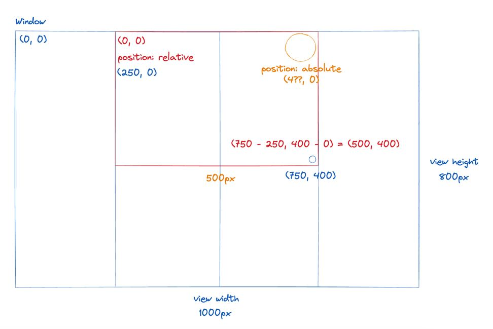

# Drag to Select Project

This project is developed based on the article by Joshua Wootton on how to create drag-to-select functionality in React. The article provides a detailed guide on building a user interface that allows users to select multiple items by dragging the mouse.

## References

- [Drag to Select Article](https://www.joshuawootonn.com/react-drag-to-select#auto-scrolling) - A detailed guide on implementing drag-to-select functionality in React.

## Features

- Drag to select multiple items within a scrollable area.
- Auto-scrolling when dragging to the edge of the area.
- Support for selecting and deselecting items.

## Getting Started

First, run the development server:

```bash
npm run dev
# or
yarn dev
# or
pnpm dev
# or
bun dev
```

Open [http://localhost:3000](http://localhost:3000) with your browser to see the result.

You can start editing the page by modifying `app/page.tsx`. The page auto-updates as you edit the file.

This project uses [`next/font`](https://nextjs.org/docs/app/building-your-application/optimizing/fonts) to automatically optimize and load [Geist](https://vercel.com/font), a new font family for Vercel.

## Learn More

To learn more about Next.js, take a look at the following resources:

- [Next.js Documentation](https://nextjs.org/docs) - learn about Next.js features and API.
- [Learn Next.js](https://nextjs.org/learn) - an interactive Next.js tutorial.
- [DOMRect Documentation](https://developer.mozilla.org/en-US/docs/Web/API/DOMRect) - learn about the DOMRect API for size and position of rectangles.

## Image


